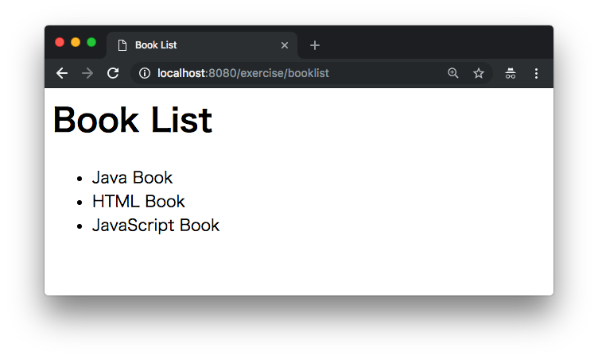
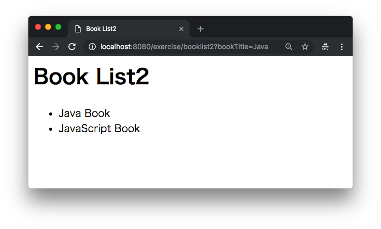
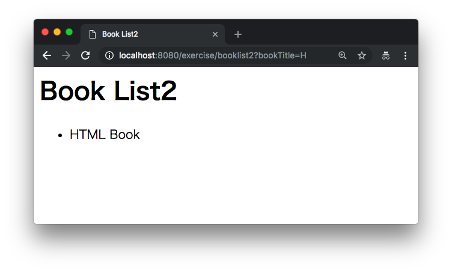
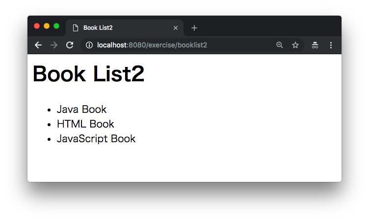
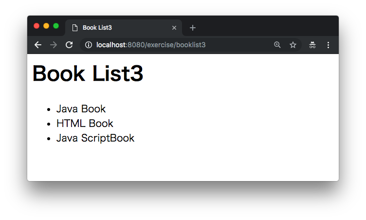
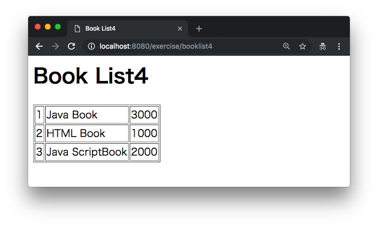
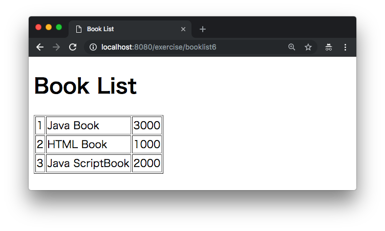

# Servlet

## 演習1

次の実行結果となるように後のServletプログラムを実装してください。

### 実行結果



### BookListServlet.java

```java
package example;

import java.io.IOException;
import java.io.PrintWriter;
import java.util.Arrays;
import java.util.List;

import javax.servlet.ServletException;
import javax.servlet.annotation.WebServlet;
import javax.servlet.http.HttpServlet;
import javax.servlet.http.HttpServletRequest;
import javax.servlet.http.HttpServletResponse;

@WebServlet("/booklist")
public class BookListServlet extends HttpServlet {

	@Override
	protected void doGet(HttpServletRequest req, HttpServletResponse resp) throws ServletException, IOException {
		List<String> bookList = Arrays.asList("Java Book", "HTML Book", "JavaScript Book");

		// TODO print book titles.

	}
}
```

---

## 演習2

次の実行結果となるように後のServletプログラムを実装してください。

### 実行結果



> クエリパラメータ ?bookTitle=Javaの場合、Javaで始まるタイトルだけを表示します。




> クエリパラメータ ?bookTitle=Hの場合、Hで始まるタイトルだけを表示します。



> クエリパラメータが存在しない場合、全タイトルを表示します。


### BookListServlet2.java

```java
package example;

import java.io.IOException;
import java.io.PrintWriter;
import java.util.ArrayList;
import java.util.Arrays;
import java.util.List;

import javax.servlet.ServletException;
import javax.servlet.annotation.WebServlet;
import javax.servlet.http.HttpServlet;
import javax.servlet.http.HttpServletRequest;
import javax.servlet.http.HttpServletResponse;

@WebServlet("/booklist2")
public class BookListServlet2 extends HttpServlet {

	@Override
	protected void doGet(HttpServletRequest req, HttpServletResponse resp) throws ServletException, IOException {

		// TODO get parameter bookTitle.
		String bookTitle = ???

		List<String> bookList = Arrays.asList("Java Book", "HTML Book", "JavaScript Book");

		// TODO print searched book titles.
	}
}
```

---

## 演習3

次のbook.csvファイルから表示データを参照するように後のServletプログラムを実装してください。

### 実行結果



### book.csv

```csv
Java Book
HTML Book
Java ScriptBook
```

### BookListServlet3.java

```java
package example;

import java.io.BufferedReader;
import java.io.IOException;
import java.io.PrintWriter;
import java.nio.file.Files;
import java.nio.file.Paths;
import java.util.ArrayList;
import java.util.Arrays;
import java.util.List;

import javax.servlet.ServletException;
import javax.servlet.annotation.WebServlet;
import javax.servlet.http.HttpServlet;
import javax.servlet.http.HttpServletRequest;
import javax.servlet.http.HttpServletResponse;

@WebServlet("/booklist3")
public class BookListServlet3 extends HttpServlet {

	@Override
	protected void doGet(HttpServletRequest req, HttpServletResponse resp) throws ServletException, IOException {

		String bookTitle = req.getParameter("bookTitle");
		if (bookTitle == null || bookTitle.equals("")) {
			bookTitle = "";
		}

		// TODO read book.csv.

		List<String> searchedBookList = new ArrayList<>();
		for (String book : bookList) {
			if (book.startsWith(bookTitle)) {
				searchedBookList.add(book);
			}
		}

		resp.setContentType("text/html; charset=UTF-8");
		PrintWriter out = resp.getWriter();
		out.println("<html>");
		out.println("<head>");
		out.println("<title>Book List3</title>");
		out.println("</head>");
		out.println("<body>");
		out.println("<h1>Book List3</h1>");
		out.println("<ul>");
		for (String book : searchedBookList) {
			out.println("<li>" + book + "</li>");
		}
		out.println("</ul>");
		out.println("</body>");
		out.println("</html>");
	}
}
```


---

## 演習4

次のbook2.csvファイルから表示データを参照するように後のBookクラス、Servletプログラムを実装してください。

### 実行結果



### book2.csv

```csv
1,Java Book,3000
2,HTML Book,1000
3,Java ScriptBook,2000
```

### Book.java

```java
// TODO define book class.
```

### BookListServlet4.java

```java
package example;

import java.io.BufferedReader;
import java.io.IOException;
import java.io.PrintWriter;
import java.nio.file.Files;
import java.nio.file.Paths;
import java.util.ArrayList;
import java.util.Arrays;
import java.util.List;

import javax.servlet.ServletException;
import javax.servlet.annotation.WebServlet;
import javax.servlet.http.HttpServlet;
import javax.servlet.http.HttpServletRequest;
import javax.servlet.http.HttpServletResponse;

@WebServlet("/booklist4")
public class BookListServlet4 extends HttpServlet {

	@Override
	protected void doGet(HttpServletRequest req, HttpServletResponse resp) throws ServletException, IOException {

		String bookTitle = req.getParameter("bookTitle");
		if (bookTitle == null || bookTitle.equals("")) {
			bookTitle = "";
		}

		List<Book> bookList = new ArrayList<>();
		// TODO read book2.csv.

		List<Book> searchedBookList = new ArrayList<>();
		for (Book book : bookList) {
			if (book.getTitle().startsWith(bookTitle)) {
				searchedBookList.add(book);
			}
		}

		resp.setContentType("text/html; charset=UTF-8");
		PrintWriter out = resp.getWriter();
		out.println("<html>");
		out.println("<head>");
		out.println("<title>Book List4</title>");
		out.println("</head>");
		out.println("<body>");
		out.println("<h1>Book List4</h1>");
		out.println("<table border=\"1\">");
		for (Book book : searchedBookList) {
			out.println("<tr>");
			out.println("<td>" + book.getId() + "</td>");
			out.println("<td>" + book.getTitle() + "</td>");
			out.println("<td>" + book.getPrice() + "</td>");
			out.println("</tr>");
		}
		out.println("</table>");
		out.println("</body>");
		out.println("</html>");
	}
}
```


---

## 演習5

Servletプログラムをリファクタリングします。

+ JSPプログラムを作成し、Servletの処理をJSPにフォワードするように変更します。

### 実行結果


### BookListServlet5.java

```java
package example;

import java.io.BufferedReader;
import java.io.IOException;
import java.io.PrintWriter;
import java.nio.file.Files;
import java.nio.file.Paths;
import java.util.ArrayList;
import java.util.Arrays;
import java.util.List;

import javax.servlet.RequestDispatcher;
import javax.servlet.ServletException;
import javax.servlet.annotation.WebServlet;
import javax.servlet.http.HttpServlet;
import javax.servlet.http.HttpServletRequest;
import javax.servlet.http.HttpServletResponse;

@WebServlet("/booklist5")
public class BookListServlet5 extends HttpServlet {

	@Override
	protected void doGet(HttpServletRequest req, HttpServletResponse resp) throws ServletException, IOException {

		String bookTitle = req.getParameter("bookTitle");
		if (bookTitle == null || bookTitle.equals("")) {
			bookTitle = "";
		}

		List<Book> bookList = new ArrayList<>();
		try (BufferedReader br = Files.newBufferedReader(Paths.get("/Users/murayama/eclipse-workspace/exercise/book2.csv"));){
			String line = br.readLine();
			while(line != null) {
				String[] items = line.split(",");
				Integer id = Integer.parseInt(items[0]);
				String title = items[1];
				Integer price = Integer.parseInt(items[2]);
				Book book = new Book(id, title, price);
				bookList.add(book);
				line = br.readLine();
			}
		}

		List<Book> searchedBookList = new ArrayList<>();
		for (Book book : bookList) {
			if (book.getTitle().startsWith(bookTitle)) {
				searchedBookList.add(book);
			}
		}

		// TODO set searchedBookList to request scope.

		// TODO forward request and response to JSP(/WEB-INF/bookList.jsp).

	}
}

```

### bookList.jsp（作成済み）

```java
<%@page import="javax.crypto.SealedObject"%>
<%@page import="java.util.List"%>
<%@page import="example.Book"%>
<%@ page language="java" contentType="text/html; charset=UTF-8"
	pageEncoding="UTF-8"%>
<%
	@SuppressWarnings("unchecked")
	List<Book> searchedBookList = (List<Book>) request.getAttribute("searchedBookList");
%>
<!DOCTYPE html>
<html>
<head>
<meta charset="UTF-8">
<title>Book List</title>
</head>
<body>
	<h1>Book List</h1>
	<table border="1">
		<%
			for (Book book : searchedBookList) {
		%>
		<tr>
			<td><%=book.getId()%></td>
			<td><%=book.getTitle()%></td>
			<td><%=book.getPrice()%></td>
		</tr>
		<%
			}
		%>
	</table>
</body>
</html>
```

> bookList.jspファイルはWEB-INFディレクトリに保存します。ブラウザからJSPファイルに対して直接アクセスできないようになります。


---

## 演習6

Servletプログラムをリファクタリングします。

+ ファイル読み込み処理をDAOクラスに実装します。


### 実行結果



### BookListServlet6.java

```java
package example;

import java.io.IOException;
import java.util.List;

import javax.servlet.RequestDispatcher;
import javax.servlet.ServletException;
import javax.servlet.annotation.WebServlet;
import javax.servlet.http.HttpServlet;
import javax.servlet.http.HttpServletRequest;
import javax.servlet.http.HttpServletResponse;

@WebServlet("/booklist6")
public class BookListServlet6 extends HttpServlet {

	@Override
	protected void doGet(HttpServletRequest req, HttpServletResponse resp) throws ServletException, IOException {

		String bookTitle = req.getParameter("bookTitle");
		if (bookTitle == null || bookTitle.equals("")) {
			bookTitle = "";
		}

		List<Book> searchedBookList = BookDAO.findByTitle(bookTitle);

		req.setAttribute("searchedBookList", searchedBookList);
		RequestDispatcher rd = req.getRequestDispatcher("/WEB-INF/bookList.jsp");
		rd.forward(req, resp);
	}

}
```


### BookDAO.java

```java
// TODO define BookDAO class.
```
